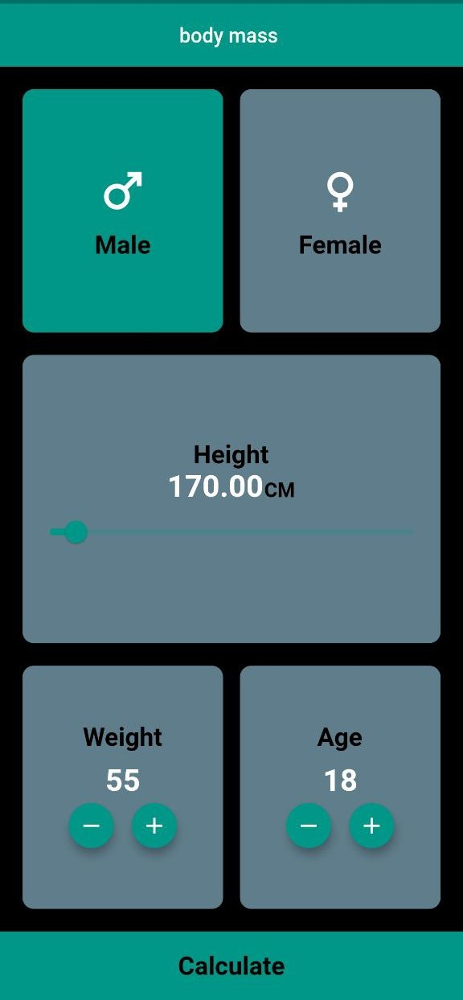
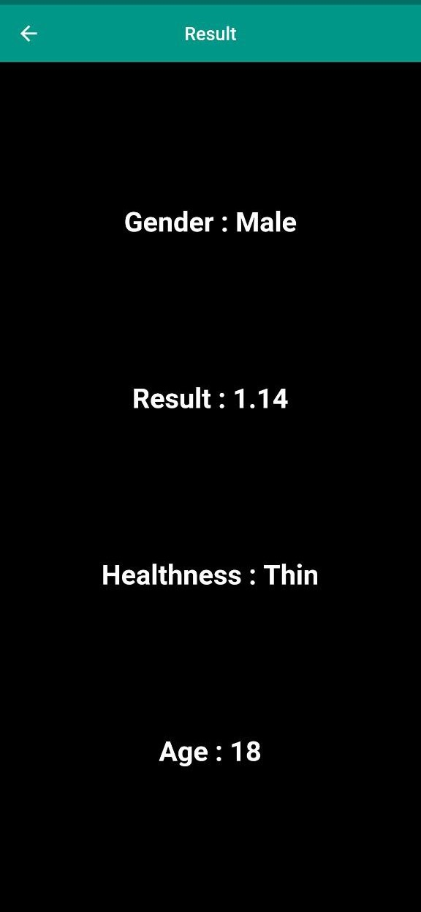

<p align="center">
  
</p>

# BMI Calculator

## Content
 - [Description](#description)
 - [Features](#features)
 - [Tools](#tools)
 - [Screenshots](#screenshots)
 - [APK Path ](#apk-path )


# Description

This BMI Calculator is a simple and intuitive mobile application built using Flutter. It allows users to calculate their Body Mass Index (BMI) based on their weight and height. The app is designed with a clean and responsive interface, supporting both metric and imperial units for input. Users receive instant feedback on their BMI along with a classification (e.g., Underweight, Normal weight, Overweight, Obese), making it easy to understand their health status.


## Features

- BMI Calculation: Calculates Body Mass Index (BMI) based on user input (weight and height).
- Metric and Imperial Units: Supports both metric (kg, cm)
- Real-time Results: Provides instant BMI calculation as users input their data.
- User-friendly Interface: Simple and intuitive UI for ease of use, with a clean and responsive design.
- BMI Categories: Displays BMI category (Underweight, Normal weight, Overweight, Obese) based on calculated BMI.
- Health Tips: Provides basic health advice or tips based on the user's BMI category


## Tools


# Screenshots

<p align="center">
  
  
</p>


## Deployment

To deploy this project run this command in terminal

```bash
 flutter build apk
```

## APK Path 
build/app/outputs/flutter-apk/app-release.apk
